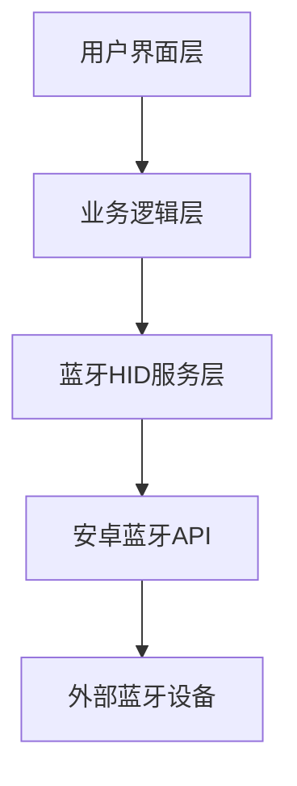

## 1. Architecture Design


## 2. Technology Description
- 前端框架: React Native + TypeScript
- 蓝牙通信: react-native-ble-plx / 原生安卓蓝牙API
- 状态管理: Zustand
- UI组件: React Native Elements
- 构建工具: Metro Bundler

## 3. Route Definitions
| Route | Purpose |
|-------|---------|
| / | 首页 - 设备连接和模式选择 |
| /keyboard | 键盘模式页面 |
| /mouse | 鼠标模式页面 |
| /gamepad | 手柄模式页面 |

## 4. API Definitions
本项目主要使用原生安卓蓝牙API，无后端API服务。

### 蓝牙HID服务接口
```typescript
interface BluetoothHIDService {
  connect(deviceId: string): Promise<boolean>;
  disconnect(): Promise<void>;
  sendKeyboardReport(report: KeyboardReport): Promise<void>;
  sendMouseReport(report: MouseReport): Promise<void>;
  sendGamepadReport(report: GamepadReport): Promise<void>;
}

interface KeyboardReport {
  modifiers: number;
  keyCodes: number[];
}

interface MouseReport {
  buttons: number;
  x: number;
  y: number;
  wheel: number;
}

interface GamepadReport {
  buttons: number;
  hat: number;
  leftStickX: number;
  leftStickY: number;
  rightStickX: number;
  rightStickY: number;
}
```

## 5. Server Architecture Diagram
本项目为纯移动应用，无后端服务器架构。

## 6. Data Model
本项目无需数据库持久化存储。

### 6.1 状态管理模型
```typescript
interface AppState {
  connectedDevice: BluetoothDevice | null;
  currentMode: 'keyboard' | 'mouse' | 'gamepad';
  bluetoothEnabled: boolean;
}

interface BluetoothDevice {
  id: string;
  name: string;
  signalStrength: number;
}
```
