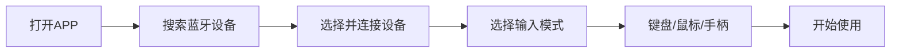

## 1. Product Overview
蓝牙键鼠APP是一款基于蓝牙HID协议的安卓应用，将手机模拟成蓝牙键盘、鼠标和游戏手柄。
- 解决缺少外部输入设备的问题，为用户提供便捷的替代方案
- 适用于演示、办公、游戏等多种场景

## 2. Core Features

### 2.1 User Roles
| Role | Registration Method | Core Permissions |
|------|---------------------|------------------|
| 用户 | 无需注册 | 完整使用所有功能 |

### 2.2 Feature Module
1. **首页**: 设备连接状态、功能导航
2. **键盘模式**: 虚拟键盘、快捷键支持
3. **鼠标模式**: 触控板、滚轮、左右键
4. **手柄模式**: 游戏按键映射、摇杆模拟

### 2.3 Page Details
| Page Name | Module Name | Feature description |
|-----------|-------------|---------------------|
| 首页 | 设备连接 | 搜索并连接蓝牙设备，显示连接状态 |
| 首页 | 功能导航 | 切换键盘、鼠标、手柄模式 |
| 键盘模式 | 虚拟键盘 | 完整的QWERTY键盘布局，支持中文输入 |
| 键盘模式 | 快捷键 | 常用快捷键组合（复制、粘贴、撤销等） |
| 鼠标模式 | 触控板 | 手指滑动控制鼠标移动 |
| 鼠标模式 | 按键 | 左键、右键、滚轮功能 |
| 手柄模式 | 虚拟摇杆 | 左摇杆控制方向 |
| 手柄模式 | 按键 | A/B/X/Y、L/R肩键、Start/Select |

## 3. Core Process
用户打开APP → 连接蓝牙设备 → 选择输入模式 → 开始使用

## 4. User Interface Design
### 4.1 Design Style
- 主色：深蓝色(#1E40AF)，次色：浅蓝色(#3B82F6)
- 按钮风格：圆角矩形，带有轻微阴影
- 字体：Roboto体系，标题18sp，正文14sp
- 布局风格：卡片式布局，底部导航栏
- 图标风格：线性图标，简洁现代

### 4.2 Page Design Overview
| Page Name | Module Name | UI Elements |
|-----------|-------------|-------------|
| 首页 | 设备连接 | 卡片式列表，每个设备显示名称和信号强度 |
| 键盘模式 | 虚拟键盘 | 深色背景，白色按键，按下时有反馈动画 |
| 鼠标模式 | 触控板 | 大面积触控区域，底部放置三个按键 |
| 手柄模式 | 游戏按键 | 左侧摇杆，右侧功能键，顶部肩键 |

### 4.3 Responsiveness
- 移动优先设计，适配各种安卓屏幕尺寸
- 横屏/竖屏自动适配
- 触摸操作优化，按键尺寸适合手指点击

### 4.4 3D Scene Guidance
本项目不包含3D场景
